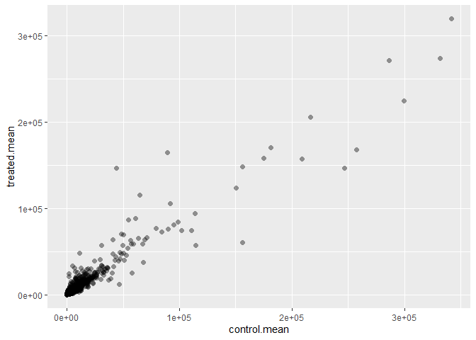
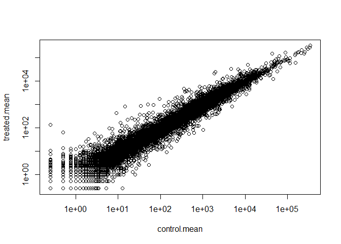

# Class 12: RNASeq Analysis
Mai Tamura (PID: A18594079)

- [Background](#background)
- [Data import](#data-import)
- [Toy differential gene expression](#toy-differential-gene-expression)
- [DESeq2 analysis](#deseq2-analysis)
- [Volcano plot](#volcano-plot)
- [Save our results](#save-our-results)
- [Add gene annotation](#add-gene-annotation)
- [Pathway analysis](#pathway-analysis)
- [Save our main results](#save-our-main-results)

## Background

Today we will analyze some RNASeq data from Himes et al. on the effects
of a common steroid (dexamethasone) on airway smooth muscle cells (ASM
cells).

Are starting point i the “counts” data and “metadata” that contain the
count values for each gene in their different experiments (i.e. cell
lines with or without drug).

## Data import

``` r
counts <- read.csv("airway_scaledcounts.csv", row.names=1)
metadata <- read.csv("airway_metadata.csv")
```

``` r
head(counts)
```

                    SRR1039508 SRR1039509 SRR1039512 SRR1039513 SRR1039516
    ENSG00000000003        723        486        904        445       1170
    ENSG00000000005          0          0          0          0          0
    ENSG00000000419        467        523        616        371        582
    ENSG00000000457        347        258        364        237        318
    ENSG00000000460         96         81         73         66        118
    ENSG00000000938          0          0          1          0          2
                    SRR1039517 SRR1039520 SRR1039521
    ENSG00000000003       1097        806        604
    ENSG00000000005          0          0          0
    ENSG00000000419        781        417        509
    ENSG00000000457        447        330        324
    ENSG00000000460         94        102         74
    ENSG00000000938          0          0          0

``` r
head(metadata)
```

              id     dex celltype     geo_id
    1 SRR1039508 control   N61311 GSM1275862
    2 SRR1039509 treated   N61311 GSM1275863
    3 SRR1039512 control  N052611 GSM1275866
    4 SRR1039513 treated  N052611 GSM1275867
    5 SRR1039516 control  N080611 GSM1275870
    6 SRR1039517 treated  N080611 GSM1275871

> Q1. How many genes are in this dataset?

``` r
nrow(counts)
```

    [1] 38694

> How many different experiments are in the dataset?

``` r
ncol(counts)
```

    [1] 8

``` r
ncol(metadata)
```

    [1] 4

> Q2. How many ‘control’ cell lines do we have?

``` r
sum(metadata$dex == "control")
```

    [1] 4

## Toy differential gene expression

To start our analysis, let’s calculate the mean for all genes in the
“control” experiments.

1.  Extract all “control” columns from the `counts` object.
2.  Calculate the mean for all rows (i.e. genes) of these “control”
    columns.

3-4. Do the same for “treated”. 5. Compare these `control.mean` and
`treated.mean` values.

``` r
control.inds <- metadata$dex == "control"
control.counts <- counts[ , control.inds]
head(control.counts)
```

                    SRR1039508 SRR1039512 SRR1039516 SRR1039520
    ENSG00000000003        723        904       1170        806
    ENSG00000000005          0          0          0          0
    ENSG00000000419        467        616        582        417
    ENSG00000000457        347        364        318        330
    ENSG00000000460         96         73        118        102
    ENSG00000000938          0          1          2          0

``` r
control.mean <- rowSums(control.counts)/4
head(control.mean)
```

    ENSG00000000003 ENSG00000000005 ENSG00000000419 ENSG00000000457 ENSG00000000460 
             900.75            0.00          520.50          339.75           97.25 
    ENSG00000000938 
               0.75 

> Q3. How would you make the above code in either approach more robust?
> Is there a function that could help here?

``` r
control.mean <- rowMeans(control.counts)
head(control.mean)
```

    ENSG00000000003 ENSG00000000005 ENSG00000000419 ENSG00000000457 ENSG00000000460 
             900.75            0.00          520.50          339.75           97.25 
    ENSG00000000938 
               0.75 

> Q4. Follow the same procedure for the treated samples (i.e. calculate
> the mean per gene across drug treated samples and assign to a labeled
> vector called treated.mean)

``` r
treated.inds <- metadata$dex == "treated"
treated.counts <- counts[ , treated.inds]
treated.mean <- rowMeans(treated.counts)
head(treated.mean)
```

    ENSG00000000003 ENSG00000000005 ENSG00000000419 ENSG00000000457 ENSG00000000460 
             658.00            0.00          546.00          316.50           78.75 
    ENSG00000000938 
               0.00 

Store together for ease of bookkeeping as `meancounts`.

``` r
meancounts <- data.frame(control.mean, treated.mean)
head(meancounts)
```

                    control.mean treated.mean
    ENSG00000000003       900.75       658.00
    ENSG00000000005         0.00         0.00
    ENSG00000000419       520.50       546.00
    ENSG00000000457       339.75       316.50
    ENSG00000000460        97.25        78.75
    ENSG00000000938         0.75         0.00

Make a plot of control vs treated.

> Q5 (a). Create a scatter plot showing the mean of the treated samples
> against the mean of the control samples.

``` r
plot(meancounts)
```


> Q5 (b).You could also use the ggplot2 package to make this figure
> producing the plot below. What geom\_?() function would you use for
> this plot?

``` r
library(ggplot2)

ggplot(meancounts, aes(control.mean, treated.mean)) +
  geom_point(alpha=0.4, size=2, shape=16) 
```



> Q6. Try plotting both axes on a log scale. What is the argument to
> plot() that allows you to do this?

``` r
plot(meancounts, log="xy")
```

    Warning in xy.coords(x, y, xlabel, ylabel, log): 15032 個の正でない x
    の値が対数プロットから除かれました

    Warning in xy.coords(x, y, xlabel, ylabel, log): 15281 個の正でない y
    の値が対数プロットから除かれました



Let’s calculate the log2 fold change for our treated over control mean
counts.

``` r
meancounts$log2fc <-
log2(meancounts$treated.mean /
  meancounts$control.mean)
```

``` r
head(meancounts)
```

                    control.mean treated.mean      log2fc
    ENSG00000000003       900.75       658.00 -0.45303916
    ENSG00000000005         0.00         0.00         NaN
    ENSG00000000419       520.50       546.00  0.06900279
    ENSG00000000457       339.75       316.50 -0.10226805
    ENSG00000000460        97.25        78.75 -0.30441833
    ENSG00000000938         0.75         0.00        -Inf

A common “rule of thumb” is a log2 fold change cutoff of +2 and -2 to
call genes “Up regulated” or “Down regulated”.

Number of “up” genes at +2 threshold

``` r
sum(meancounts$log2fc >= +2, na.rm=T)
```

    [1] 1910

Number of “down” genes at -2 threshold

``` r
sum(meancounts$log2fc <= -2, na.rm=T)
```

    [1] 2330

Let’s filter our data to remove genes with zero expression.

``` r
zero.vals <- which(meancounts[,1:2]==0, arr.ind=TRUE)
head(zero.vals)
```

                    row col
    ENSG00000000005   2   1
    ENSG00000004848  65   1
    ENSG00000004948  70   1
    ENSG00000005001  73   1
    ENSG00000006059 121   1
    ENSG00000006071 123   1

``` r
mycounts <- meancounts[-unique(zero.vals[,1]),]
head(mycounts)
```

                    control.mean treated.mean      log2fc
    ENSG00000000003       900.75       658.00 -0.45303916
    ENSG00000000419       520.50       546.00  0.06900279
    ENSG00000000457       339.75       316.50 -0.10226805
    ENSG00000000460        97.25        78.75 -0.30441833
    ENSG00000000971      5219.00      6687.50  0.35769358
    ENSG00000001036      2327.00      1785.75 -0.38194109

> Q7. What is the purpose of the arr.ind argument in the which()
> function call above? Why would we then take the first column of the
> output and need to call the unique() function?

The `arr.ind = TRUE` causes `which()` to return both the row and column
indices (positions) where the condition is TRUE, instead of just the
linear indices. The `unique()` returns only the distinct elements from
its input, removing any duplicates.

> Q8. Can you determine how many up regulated genes we have at the
> greater than 2 fc level?

``` r
sum(mycounts$log2fc > +2, na.rm=T)
```

    [1] 250

> Q9. Can you determine how many down regulated genes we have at the
> greater than 2 fc level?

``` r
sum(mycounts$log2fc < -2, na.rm=T)
```

    [1] 367

> Q10. Do you trust these results? Why or why not?

No, these results are not fully trustworthy since fold change does not
show statistically significance and are likely to be very misleading.

## DESeq2 analysis

Let’s do this analysis properly and keep our inner stats happy -
i.e. are the differences we see between drug and no drug significant
given the replicate experiments.

``` r
library(DESeq2)
```

    Warning: パッケージ 'matrixStats' はバージョン 4.5.2 の R の下で造られました

For DESeq analysis, we need three things.

- count values (`countData`)
- metadata telling us about the columns in `contData` (`colData`)
- design of the experiment (i.e. what do you want to compare)

Our first function from DESeq2 will setup the input required for
analysis by storing these 3 things together.

``` r
dds <- DESeqDataSetFromMatrix(countData = counts,
                              colData = metadata,
                              design = ~dex)
```

    converting counts to integer mode

    Warning in DESeqDataSet(se, design = design, ignoreRank): some variables in
    design formula are characters, converting to factors

The main function in DESeq that runs the analysis is called `DESeq()`.

``` r
dds <- DESeq(dds)
```

    estimating size factors

    estimating dispersions

    gene-wise dispersion estimates

    mean-dispersion relationship

    final dispersion estimates

    fitting model and testing

``` r
res <- results(dds)
head(res)
```

    log2 fold change (MLE): dex treated vs control 
    Wald test p-value: dex treated vs control 
    DataFrame with 6 rows and 6 columns
                      baseMean log2FoldChange     lfcSE      stat    pvalue
                     <numeric>      <numeric> <numeric> <numeric> <numeric>
    ENSG00000000003 747.194195     -0.3507030  0.168246 -2.084470 0.0371175
    ENSG00000000005   0.000000             NA        NA        NA        NA
    ENSG00000000419 520.134160      0.2061078  0.101059  2.039475 0.0414026
    ENSG00000000457 322.664844      0.0245269  0.145145  0.168982 0.8658106
    ENSG00000000460  87.682625     -0.1471420  0.257007 -0.572521 0.5669691
    ENSG00000000938   0.319167     -1.7322890  3.493601 -0.495846 0.6200029
                         padj
                    <numeric>
    ENSG00000000003  0.163035
    ENSG00000000005        NA
    ENSG00000000419  0.176032
    ENSG00000000457  0.961694
    ENSG00000000460  0.815849
    ENSG00000000938        NA

## Volcano plot

This is common summary figure from these types of experiments and plot
the log2 fold-change vs the adjusted p-value.

``` r
plot(res$log2FoldChange, res$padj)
```


``` r
plot(res$log2FoldChange, -log(res$padj))
abline(v=c(-2,2), col="red")
abline(h=-log(0.04), col="red")
```


``` r
log(0.4)
```

    [1] -0.9162907

``` r
log(0.04)
```

    [1] -3.218876

## Save our results

``` r
write.csv(res, file="my_results.csv")
```

## Add gene annotation

To help make sense of our results an communicate them to other folks we
need to add some more annotation to our main `res` object.

We will use two bioconductor packages to first map IDs to different
formats including the classic gene “symbol” gene name.

I will install these with the following commands.
`BicManager::install("AnnotationDbi")`
`BicManager::install("org.Hs.eg.db")`

``` r
library(AnnotationDbi)
library(org.Hs.eg.db)
```

Let’s see what is in `org.Hs.eg.db`

``` r
columns(org.Hs.eg.db)
```

     [1] "ACCNUM"       "ALIAS"        "ENSEMBL"      "ENSEMBLPROT"  "ENSEMBLTRANS"
     [6] "ENTREZID"     "ENZYME"       "EVIDENCE"     "EVIDENCEALL"  "GENENAME"    
    [11] "GENETYPE"     "GO"           "GOALL"        "IPI"          "MAP"         
    [16] "OMIM"         "ONTOLOGY"     "ONTOLOGYALL"  "PATH"         "PFAM"        
    [21] "PMID"         "PROSITE"      "REFSEQ"       "SYMBOL"       "UCSCKG"      
    [26] "UNIPROT"     

We can translate or “map” IDs between any of these 26 databases using
the `mapIds()` function.

``` r
res$symbol <- mapIds(keys = row.names(res), # our current IDs
                     keytype = "ENSEMBL",   # the format of our IDs
                     x = org.Hs.eg.db,      # where to get the mappings from
                     column = "SYMBOL")     # the format/DB to map to
```

    'select()' returned 1:many mapping between keys and columns

``` r
head(res)
```

    log2 fold change (MLE): dex treated vs control 
    Wald test p-value: dex treated vs control 
    DataFrame with 6 rows and 7 columns
                      baseMean log2FoldChange     lfcSE      stat    pvalue
                     <numeric>      <numeric> <numeric> <numeric> <numeric>
    ENSG00000000003 747.194195     -0.3507030  0.168246 -2.084470 0.0371175
    ENSG00000000005   0.000000             NA        NA        NA        NA
    ENSG00000000419 520.134160      0.2061078  0.101059  2.039475 0.0414026
    ENSG00000000457 322.664844      0.0245269  0.145145  0.168982 0.8658106
    ENSG00000000460  87.682625     -0.1471420  0.257007 -0.572521 0.5669691
    ENSG00000000938   0.319167     -1.7322890  3.493601 -0.495846 0.6200029
                         padj      symbol
                    <numeric> <character>
    ENSG00000000003  0.163035      TSPAN6
    ENSG00000000005        NA        TNMD
    ENSG00000000419  0.176032        DPM1
    ENSG00000000457  0.961694       SCYL3
    ENSG00000000460  0.815849       FIRRM
    ENSG00000000938        NA         FGR

Add the mappings for “GENENAME” and “ENTREZID” and store as
`res$genename` and `res$entrez`

``` r
res$genename <- mapIds(keys = row.names(res), # our current IDs
                       keytype = "ENSEMBL",   # the format of our IDs
                       x = org.Hs.eg.db,      # where to get the mappings from
                       column = "GENENAME")   # the format/DB to map to
```

    'select()' returned 1:many mapping between keys and columns

``` r
res$entrez <- mapIds(keys = row.names(res), # our current IDs
                     keytype = "ENSEMBL",   # the format of our IDs
                     x = org.Hs.eg.db,      # where to get the mappings from
                     column = "ENTREZID")   # the format/DB to map to
```

    'select()' returned 1:many mapping between keys and columns

``` r
head(res)
```

    log2 fold change (MLE): dex treated vs control 
    Wald test p-value: dex treated vs control 
    DataFrame with 6 rows and 9 columns
                      baseMean log2FoldChange     lfcSE      stat    pvalue
                     <numeric>      <numeric> <numeric> <numeric> <numeric>
    ENSG00000000003 747.194195     -0.3507030  0.168246 -2.084470 0.0371175
    ENSG00000000005   0.000000             NA        NA        NA        NA
    ENSG00000000419 520.134160      0.2061078  0.101059  2.039475 0.0414026
    ENSG00000000457 322.664844      0.0245269  0.145145  0.168982 0.8658106
    ENSG00000000460  87.682625     -0.1471420  0.257007 -0.572521 0.5669691
    ENSG00000000938   0.319167     -1.7322890  3.493601 -0.495846 0.6200029
                         padj      symbol               genename      entrez
                    <numeric> <character>            <character> <character>
    ENSG00000000003  0.163035      TSPAN6          tetraspanin 6        7105
    ENSG00000000005        NA        TNMD            tenomodulin       64102
    ENSG00000000419  0.176032        DPM1 dolichyl-phosphate m..        8813
    ENSG00000000457  0.961694       SCYL3 SCY1 like pseudokina..       57147
    ENSG00000000460  0.815849       FIRRM FIGNL1 interacting r..       55732
    ENSG00000000938        NA         FGR FGR proto-oncogene, ..        2268

## Pathway analysis

There are lots of bioconductor packages to do this type of analysis. For
now let’s just try one called **gage** again we need to install this if
we don’t have it already.

``` r
library(gage)
library(gageData)
library(pathview)
```

To use **gage** I need to two things

- a named vector of DEGs (our geneset of interest)
- a set of pathways or datasets to use for annotation

``` r
x <- c("barry"=5, "lisa"=10)
x
```

    barry  lisa 
        5    10 

``` r
names(x) <- c("low", "high")
x
```

     low high 
       5   10 

``` r
foldchanges <- res$log2FoldChange
names(foldchanges) <- res$entrez
head(foldchanges)
```

           7105       64102        8813       57147       55732        2268 
    -0.35070302          NA  0.20610777  0.02452695 -0.14714205 -1.73228897 

``` r
data(kegg.sets.hs)

keggres = gage(foldchanges, gsets = kegg.sets.hs)
```

In our results object we have:

``` r
attributes(keggres)
```

    $names
    [1] "greater" "less"    "stats"  

``` r
head(keggres$less, 5)
```

                                                             p.geomean stat.mean
    hsa05332 Graft-versus-host disease                    0.0004250461 -3.473346
    hsa04940 Type I diabetes mellitus                     0.0017820293 -3.002352
    hsa05310 Asthma                                       0.0020045888 -3.009050
    hsa04672 Intestinal immune network for IgA production 0.0060434515 -2.560547
    hsa05330 Allograft rejection                          0.0073678825 -2.501419
                                                                 p.val      q.val
    hsa05332 Graft-versus-host disease                    0.0004250461 0.09053483
    hsa04940 Type I diabetes mellitus                     0.0017820293 0.14232581
    hsa05310 Asthma                                       0.0020045888 0.14232581
    hsa04672 Intestinal immune network for IgA production 0.0060434515 0.31387180
    hsa05330 Allograft rejection                          0.0073678825 0.31387180
                                                          set.size         exp1
    hsa05332 Graft-versus-host disease                          40 0.0004250461
    hsa04940 Type I diabetes mellitus                           42 0.0017820293
    hsa05310 Asthma                                             29 0.0020045888
    hsa04672 Intestinal immune network for IgA production       47 0.0060434515
    hsa05330 Allograft rejection                                36 0.0073678825

Let’s look at one of these pathways with our genes colored up so we can
see the overlap

``` r
pathview(pathway.id = "hsa05310", gene.data = foldchanges)
```

    'select()' returned 1:1 mapping between keys and columns

    Info: Working in directory C:/Users/maima/OneDrive/ドキュメント/School/UCSD/Class/BIMM 143 FA'25/bimm143_github/class12

    Info: Writing image file hsa05310.pathview.png

Add this pathway figure to our lab report


## Save our main results

``` r
write.csv(res, file="myresults_annotated.csv")
```
